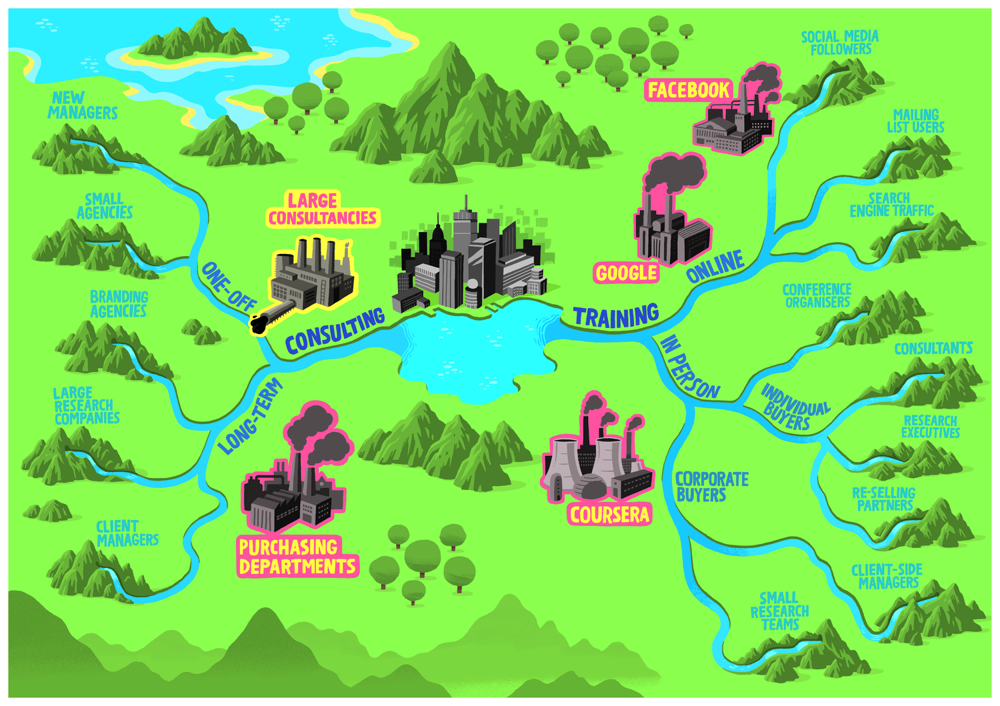

# Revenue Stream Map

The purpose of this facilitation game is to spark divergent, creative thinking about stakeholder/actor groups. 
The best time to run this is before drawing the first draft of the impact map.

* [Game Summary](game-summary.md)
